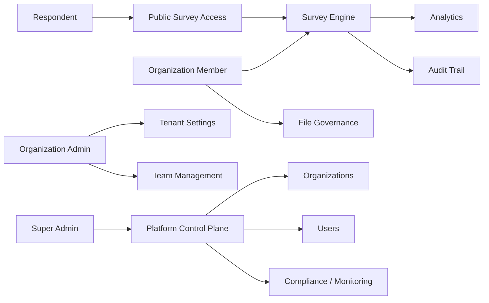
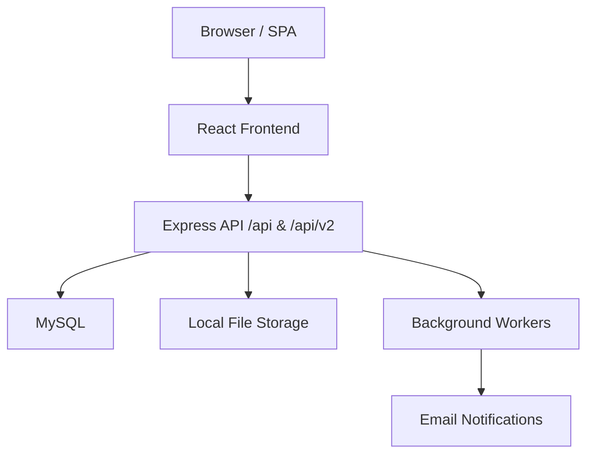
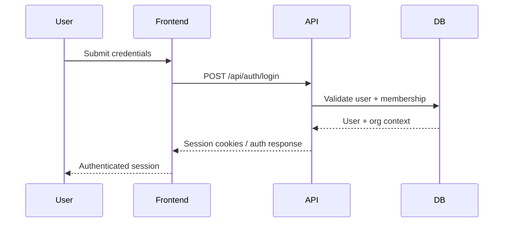
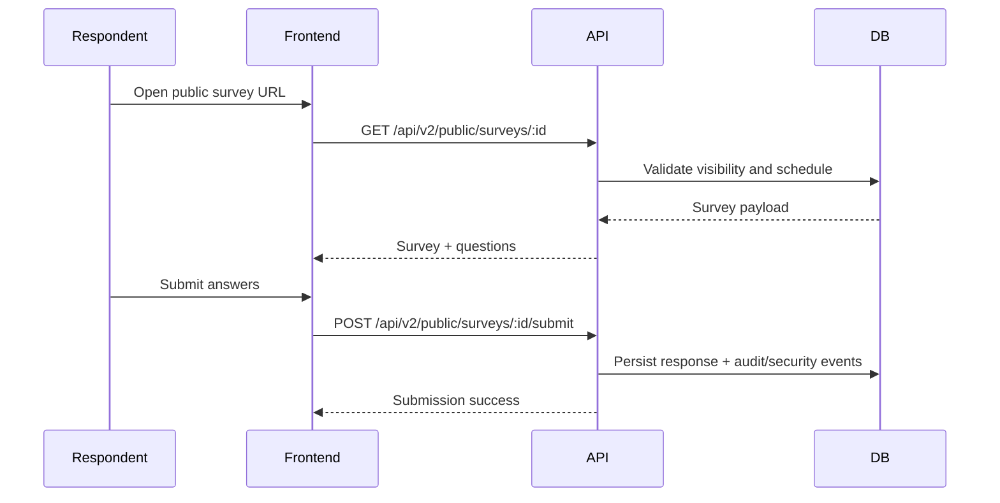
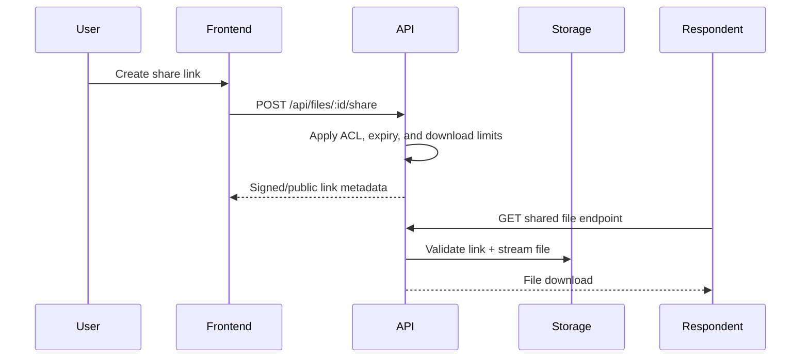
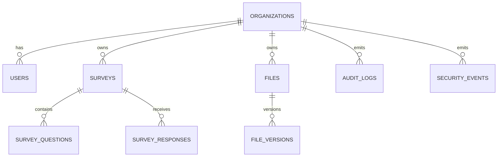

# 📊 SpectraSurvey - Intensive Analysis (Technical + Business)

---

## 📑 Table of Contents

1. [🧭 Executive Summary](#-executive-summary)
2. [🎯 Application Purpose](#-application-purpose)
   - [Primary Purpose](#primary-purpose)
   - [Business Value](#business-value)
3. [🏢 Business Architecture](#-business-architecture)
   - [Main Actors](#main-actors)
   - [Capability Map](#capability-map-business)
   - [Business Map (Mermaid)](#business-map-mermaid)
4. [✨ Application Features](#-application-features)
   - [Authentication, Identity, Security](#41-authentication-identity-security)
   - [Full Survey Lifecycle](#42-full-survey-lifecycle)
   - [Response Collection (Public/Private)](#43-response-collection-publicprivate)
   - [Analytics and Reporting](#44-analytics-and-reporting)
   - [Groups, Invitations, Distribution](#45-groups-invitations-distribution)
   - [File Module (DAM)](#46-file-module-dam)
   - [Team and Organization Settings](#47-team-and-organization-settings)
   - [Platform Admin (Super Admin)](#48-platform-admin-super-admin)
   - [Audit and Compliance](#49-audit-and-compliance)
5. [🏗️ Technical Architecture](#️-technical-architecture)
   - [Technology Stack](#51-technology-stack)
   - [Backend Runtime Flag (QA/CI)](#511-backend-runtime-flag-qaci)
   - [Technical Map (System)](#52-technical-map-system)
   - [Frontend Component Architecture](#53-frontend-component-architecture)
   - [Express Backend (Functional Zones)](#54-express-backend-functional-zones)
6. [🔄 Technical Flow Map](#-technical-flow-map)
   - [Login Flow](#61-login-flow-simplified)
   - [Public Survey Submit Flow](#62-public-survey-submit-flow)
   - [Secure File Sharing Flow](#63-secure-file-sharing-flow)
7. [🗃️ Data Architecture](#️-data-architecture)
   - [Data Domains](#71-data-domains)
   - [High-Level ER (Mermaid)](#72-high-level-er-mermaid)
   - [Multi-Tenancy](#73-multi-tenancy)
8. [🧩 Product Offering](#-product-offering)
9. [📄 License](#-license)

---

## 🧭 Executive Summary

**SpectraSurvey** is a multi-tenant platform designed for:

- creating, distributing, and analyzing surveys,
- managing organizational files through storage, sharing, and versioning,
- enabling team and organization administration with audit and compliance visibility,
- supporting centralized super-admin operations across tenants.

The product is already feature-rich and operationally valuable, but it still carries architectural complexity due to a mixed runtime model:
- **Express + MySQL** as the main backend foundation,
- **direct Supabase usage** still present in parts of the frontend and legacy flows.

This hybrid model increases maintenance cost, raises testing complexity, and introduces long-term consistency risks.

---

## 🎯 Application Purpose

### Primary Purpose

Provide organizations with a unified system for:

- survey operations,
- associated data and digital asset management,
- controlled collaboration,
- compliance visibility and governance.

### Business Value

- 📬 Improve response rates through multi-channel distribution and optimized public UX.
- 🧾 Provide traceability through audit and compliance visibility for enterprise and regulated use cases.
- 🗂️ Centralize survey data and digital assets in one operational workspace.
- 🏢 Support multi-tenant organizational administration with role-based control.
- 📊 Enable insight generation through survey analytics and response exploration.

---

## 🏢 Business Architecture

### Main Actors

- **Organization Member**: creates surveys, analyzes results, manages files.
- **Organization Admin**: manages members, policies, settings, and access.
- **Platform Super Admin**: governs tenants, users, and global configurations.
- **Respondent (External/Public)**: completes surveys through public or private access flows.

### Capability Map (Business)

- **Research Operations**: survey design, publishing, response collection.
- **Analytics & Insight**: dashboards, exports, response-level analysis.
- **Digital Asset Management**: folders, files, versions, sharing, trash.
- **Tenant Administration**: members, roles, organization settings.
- **Platform Governance**: global admin, monitoring, compliance controls.

### Business Map (Mermaid)

---

## ✨ Application Features

### 4.1 Authentication, Identity, Security

- 🔐 Login, signup, reset, and MFA flow.
- 👤 Separate contexts for standard users and super-admin.
- 🕓 Login history and security event visibility.
- ✉️ Organization confirmation and invite flows.
- 🚦 Rate limiting on authentication endpoints.

### 4.2 Full Survey Lifecycle

- 📝 Create, edit, and delete surveys.
- 🧱 Question builder with types, logic, and ordering.
- 🗓️ Scheduling and lifecycle controls (start, end, archive, trash).
- 💾 Auto-save draft and recovery support.

### 4.3 Response Collection (Public/Private)

- 🌍 Public survey pages with access guards.
- 🔒 Password-protected surveys and additional validation flows.
- 👥 Invitation-based and group-based distribution.
- 🛡️ Anti-abuse controls such as captcha or challenge flows where applicable.

### 4.4 Analytics and Reporting

- 📊 Overview dashboard and response trends.
- 🔎 Individual response inspection.
- 🔁 Cross-survey comparisons.
- 📤 Export options such as CSV, Excel, and PDF where enabled.

### 4.5 Groups, Invitations, Distribution

- 🧩 Audience segmentation through groups.
- ✉️ Invitation lifecycle: send, resend, expire, complete.
- 🔗 Share links and QR-based distribution.

### 4.6 File Module (DAM)

- 📁 Folder and file hierarchy.
- 🕘 File versioning with auto/manual version history.
- 🔐 Secure sharing options:
  - expiration,
  - maximum downloads,
  - password protection,
  - email delivery.

### 4.7 Team and Organization Settings

- 👥 Team invite, remove, and role change flows.
- 🔐 Per-user MFA toggle.
- 🎨 Organization branding such as name and logo.
- ⚙️ Organization-level policies and settings.

### 4.8 Platform Admin (Super Admin)

- 🏢 Organization management.
- 👤 User management and privilege elevation.
- 📈 Platform reports and global controls.
- 📝 Release notes and version management.
- 🛡️ Global audit and compliance views.

### 4.9 Audit and Compliance

- 📋 Activity logs by organization.
- 🚨 Security event timeline.
- 🔑 Login history views.
- 💓 Operational telemetry and health visibility.

---

## 🏗️ Technical Architecture

### 5.1 Technology Stack

- **Frontend**: React + TypeScript + Vite.
- **UI / Routing**: React Router, modular domain pages.
- **Backend API**: Node.js + Express + security middleware.
- **Database**: MySQL

### 5.2 Technical Map (System)

### 5.3 Frontend Component Architecture

- 🧭 Domain-oriented pages in `src/pages/*`
- 🧩 Reusable UI components in `src/components/*`
- 🔌 API and services layer in `src/services/*`
- 🪝 Hooks for data fetching and mutations in `src/hooks/*`

### 5.4 Express Backend (Functional Zones)

- Auth, session, and token flows.
- Survey management and public submission endpoints.
- File, folder, version, and share endpoints.
- Organization, member, and role endpoints.
- Audit, security, and admin routes.
- Worker jobs for backups, cleanup, and observability.

---

## 🔄 Technical Flow Map

### 6.1 Login Flow (Simplified)

### 6.2 Public Survey Submit Flow

### 6.3 Secure File Sharing Flow

---

## 🗃️ Data Architecture

### 7.1 Data Domains

- **Identity and Access**: users, organization memberships, roles.
- **Survey Domain**: surveys, questions, responses, invitations.
- **File Domain**: folders, files, versions, shares, logs.
- **Governance Domain**: audit logs, security events, cron logs, reports.

### 7.2 High-Level ER (Mermaid)

### 7.3 Multi-Tenancy

- Most domains are organization-scoped.
- Isolation is implemented through schema structure and server-side access checks.
- Strict regression testing is required for every tenant route and hook to avoid cross-organization leakage.

---

## 🧩 Product Offering

- **Research Engine**: advanced survey creation and execution.
- **Insight Engine**: analytics and reporting.
- **Collaboration Engine**: teams, roles, organization settings.
- **File Governance Engine**: secure file management and sharing.
- **Control Plane**: global admin, audit, compliance, and monitoring.

---

## 📄 License

Distributed under the Proprietary License. See `LICENSE` for more information.

---

  **Built with ❤️ by the SpectraEYE Team**

